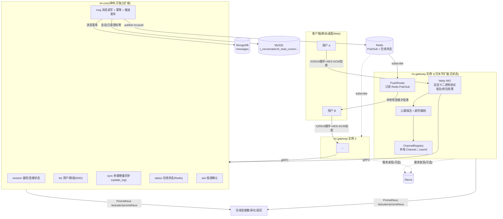

# im-platform

基于 Java + Netty 的 IM(即时通讯)核心基础项目。两个部署单元:**im-gateway**(长连接网关,独立部署,Netty 处理客户端连接 + 自研二进制协议)+ **im-core**(IM 核心域,单体服务,内部合并了鉴权/用户群组/消息/同步/在线状态/文件等能力)。业务系统通过 **im-sdk**(gRPC 客户端库)和 im-core 暴露的**回调钩子**接入,不需要理解 IM 内部实现。

> 这个仓库经历过一次架构调整:最初按文档字面拆成 13 个独立微服务,接入 protobuf 编译链路、实测跑通调用链路后,发现"每加一条跨服务调用就要接一遍服务发现/序列化/异常映射"的运维成本对当前阶段不划算,于是合并成现在的两服务结构(参考 OpenIM 的产品化思路:IM 是一个自成一体的能力,业务只做集成,不做二次拆分)。下面的内容只描述**当前**状态。

## 目录

- [架构总览](#架构总览)
- [模块清单](#模块清单)
- [长连接网关核心能力](#长连接网关核心能力)
- [网关协议:密钥协商与加解密](#网关协议密钥协商与加解密)
- [回调扩展机制](#回调扩展机制)
- [技术栈](#技术栈)
- [目录结构](#目录结构)
- [快速开始](#快速开始)
- [测试与压测](#测试与压测)
- [已验证的端到端链路](#已验证的端到端链路)
- [数据层设计](#数据层设计)
- [核心设计约定](#核心设计约定)
- [验收标准完成情况](#验收标准完成情况)
- [当前进度与已知缺口](#当前进度与已知缺口)
- [CI](#ci)
- [后续路线](#后续路线)

## 架构总览



**跨网关路由的关键设计**:一条消息落库后,`PushPublisher` 把 `PushMessage` 发布到 Redis Pub/Sub 频道 `im:push`,**所有** gateway 实例都订阅同一个频道;每个实例的 `PushRouter` 收到后先查自己本地的 `ChannelRegistry` 有没有目标用户的连接,有就加密投递,没有就直接忽略——不需要一个全局的"用户在哪个实例"路由表,天然支持水平扩展。

**核心原则**

1. **两个部署单元,不是十几个**:im-gateway 独立是因为连接层的扩缩容特性(长连接数)和后面的业务逻辑(CPU/DB 负载)完全不同,这个拆分有真实收益;其余能力(鉴权、用户群组、消息、同步、在线状态、文件)内聚性强、调用链短,合并成一个进程,省掉服务发现和跨进程序列化的成本。
2. **业务通过 SDK + 回调接入,不是通过拆更多服务接入**:内容审核/翻译/AI 分析这类"业务想怎么定制就怎么定制"的能力,暴露成回调钩子,业务在自己的系统里实现、配置 URL 接管,IM 核心不关心业务怎么做决策。
3. **网关无状态,连接层例外**:除了"这条 TCP 连接对应哪个 auth_key_id/密钥/userId"这种必须留在本地内存的连接态,gateway 不持有任何跨实例共享状态——在线状态在 Redis、消息在 MySQL、离线补偿靠拉取,任意一个 gateway 实例挂了重启,不丢消息(见[集成测试](#测试与压测))。
4. **幂等性贯穿写入链路**(`client_msg_id` 去重)和**投递链路**(`message_id` 全局唯一 + ACK 去重)。

## 模块清单

| 模块 | 部署方式 | 说明 |
|---|---|---|
| [im-gateway](im-gateway) | 独立部署 | 长连接网关,Netty 处理客户端连接,协议解包后转发给 im-core |
| [im-core](im-core) | 独立部署(单体) | IM 核心域,见下方内部结构 |
| [im-core-api](im-core-api) | 库(被依赖) | im-core 对外的全部 gRPC 接口定义与生成的 stub,只含 proto,不含业务逻辑 |
| [im-sdk](im-sdk) | 库(被依赖) | 业务后端接入用的瘦客户端,封装 im-core-api 的 stub |
| [im-bom](im-bom) | 库(被依赖) | 全仓依赖版本统一管理 |
| [im-common/im-common-core](im-common/im-common-core) | 库(被依赖) | 统一返回体 `Result`、异常体系 `BizException`/`ErrorCode`、公共常量 |
| [im-common/im-common-protocol](im-common/im-common-protocol) | 库(被依赖) | 公共 proto 消息(`Empty`/`GatewayRequest`/`GatewayResponse`/`ServerFrame`/`PushMessage`)、X25519+AES-GCM 加解密(`crypto` 包)、`BizExceptionInterceptor`、`PushChannels`(网关间 Redis 频道名常量) |

### im-gateway 内部结构

```
com.im.platform.gateway
├── server/NettyGatewayServer     # SmartLifecycle,起 Netty 长连接监听(含 SO_BACKLOG 调优)+ 业务线程池
├── codec/FrameMessageCodec       # 长度前缀帧的拆包/拼包(粘包/半包处理),不关心加密细节
├── handler/GatewayChannelHandler # 识别 NegotiateKey(不加密)还是业务帧(加密),丢线程池处理;IdleStateEvent 踢线
├── crypto/ConnectionKeyStore     # auth_key_id -> AES 密钥,进程内内存 + TTL + 定时清扫
├── session/ChannelRegistry       # 本地 UserId <-> Channel(Set,支持多端登录)双向映射
├── push/
│   ├── PushRouter                # 订阅 Redis "im:push" 频道,查本地 ChannelRegistry 决定要不要投递
│   └── PushListenerConfig        # RedisMessageListenerContainer 配置
├── metrics/GatewayMetrics        # 在线连接数(Gauge)、推送吞吐(Counter)、投递延迟(Timer/直方图)
├── client/CoreGrpcClients        # 到 im-core 的 gRPC 连接 + 7 个服务的 BlockingStub
└── router/
    ├── MethodIds                 # method_id 编号常量(网关私有协议,含 9001 心跳/9002 ACK/9003 推送)
    ├── MethodRegistry             # method_id -> 具体 gRPC 调用(泛型注册,开闭原则)
    └── MethodRouter               # NegotiateKey 特殊处理 + 业务帧解密/路由/加密 + 会话绑定(Authenticate/Heartbeat/ACK/CloseSession 的副作用)
```

### im-core 内部结构

`im-core` 是单个 Spring Boot 应用,内部按原来的服务边界分包,只是不再跨进程调用:

```
com.im.platform
├── CoreApplication.java          # 主启动类,故意放在根包(见"核心设计约定")
├── core/
│   ├── callback/                 # 回调扩展机制
│   ├── push/PushPublisher        # 消息落库后发布 PushMessage 到 Redis "im:push"
│   └── grpc/GrpcServerLifecycle  # 唯一的 gRPC server,注册全部服务
├── session/                      # 鉴权、连接状态(Redis)
├── biz/                          # DDD 四层:domain / application / infrastructure / interfaces.grpc
├── conversation/                 # 单聊会话(t_conversation)+ RecipientResolver(单聊/群聊统一解析接收者)
├── msg/
│   ├── service/MessageWriteService  # 幂等去重 → 敏感词 → 回调 → 落库 → 同步通知 → 推送发布
│   ├── service/AckService           # ACK 记录(Redis Set),供离线补偿去重判断
│   └── service/MessageMetrics       # 消息吞吐 Counter
├── sync/                          # 多端增量同步(按用户 seq 递增的 t_update_log,离线补偿的核心)
├── status/                        # 在线状态(Redis TTL,弱一致)
├── idgen/                         # 发号,纯内部组件(雪花算法变种)
├── dfs/                           # 文件上传凭证(MinIO 预签名 URL)
└── push/                          # 离线推送(APNs/FCM),跟 core/push 的在线推送是两条独立路径
    ├── service/PushTokenService          # 设备 token 登记(t_push_token)
    ├── service/OfflinePushTriggerService # 离线+未免打扰才触发,按用户名下每台设备分别转发
    └── channel/OfflinePushChannel        # 厂商通道 SPI,默认只打日志,业务接真实 APNs/FCM 在这里扩展
```

## 长连接网关核心能力

对应验收范围里"长连接网关"这一块,逐项说明落在哪些类里:

| 能力 | 实现 | 关键点 |
|---|---|---|
| Netty NIO 长连接 | [`NettyGatewayServer`](im-gateway/src/main/java/com/im/platform/gateway/server/NettyGatewayServer.java) | `bossGroup(1) + workerGroup()`,`SO_BACKLOG=65536`(压测中发现默认值在突发建连时会导致 accept 队列溢出,详见压测报告) |
| 自定义二进制协议 | [`FrameMessageCodec`](im-gateway/src/main/java/com/im/platform/gateway/codec/FrameMessageCodec.java) | `ByteToMessageCodec`,帧格式 `[4B总长][8B authKeyId][12B msgKey/IV][剩余密文]`;单元测试覆盖粘包(一次读到两帧)和半包(帧被拆成多次到达)两种场景 |
| 心跳保活 + 超时踢线 | `IdleStateHandler` + [`GatewayChannelHandler.userEventTriggered`](im-gateway/src/main/java/com/im/platform/gateway/handler/GatewayChannelHandler.java) | `gateway.idle-timeout-seconds`(默认 90s)内没收到任何字节(含心跳)就主动断开 |
| Channel↔UserId 双向映射 | [`ChannelRegistry`](im-gateway/src/main/java/com/im/platform/gateway/session/ChannelRegistry.java) | `ConcurrentHashMap<Long, Set<Channel>>`,一个用户可以对应多条 Channel(多端登录) |
| Redis 在线状态 | `status` 服务(im-core) | Authenticate/Heartbeat 时刷新,TTL 到期视为离线(弱一致,不强依赖) |
| 单聊路由 | `RecipientResolver` 查 `t_conversation` | `chat_id` 唯一映射两个用户,幂等(重复 `GetOrCreateSingleChat` 拿到同一个 `chat_id`) |
| 群聊扩散投递 | `RecipientResolver` 查 `GroupRepository` | 群聊约定 `chat_id == group_id`,解析出全部成员(除发送者)逐个投递 |
| 跨网关实例路由 | Redis Pub/Sub(`PushPublisher` 发布 / `PushRouter` 订阅) | 所有实例订阅同一频道,谁本地有连接谁投递,不需要全局路由表 |
| ACK 确认机制 | method_id=9002,[`MethodRouter.ackMessage`](im-gateway/src/main/java/com/im/platform/gateway/router/MethodRouter.java) → [`AckService`](im-core/src/main/java/com/im/platform/msg/service/AckService.java) | 客户端收到推送后回 ACK,服务端记录(Redis Set,7 天 TTL) |
| 消息去重(幂等) | 发送侧:`client_msg_id` → Redis;投递侧:`message_id`(全局唯一)+ ACK 记录 | 已经通过实时推送确认过的消息,离线补偿拉取时会被过滤掉,不重复下发 |
| 离线消息补偿 | `sync` 模块的 `t_update_log`,`PullUpdates`(method_id=4001) | 消息落库时给发送者和**全部接收者**各写一条更新日志;接收者上线后带着 `last_seq` 拉取增量,天然覆盖"从没连接过""连接过又断开""网关实例宕机重启"三种离线场景(见[集成测试](#测试与压测)) |
| 服务发现 | Nacos(可选) | `im-gateway` 用来找 `im-core` 实例;本地开发可以 `--spring.cloud.nacos.discovery.enabled=false` 跳过 |
| 无状态水平扩展 | 见上方架构图 | gateway 实例之间唯一的"状态"是各自内存里的连接表,靠 Redis Pub/Sub 广播抹平"用户在哪个实例"的问题 |
| Prometheus 监控 | [`GatewayMetrics`](im-gateway/src/main/java/com/im/platform/gateway/metrics/GatewayMetrics.java) + [`MessageMetrics`](im-core/src/main/java/com/im/platform/msg/service/MessageMetrics.java) | `im_gateway_online_connections`/`im_gateway_online_users`(Gauge)、`im_gateway_messages_pushed_total`(Counter)、`im_gateway_push_delivery_latency_seconds`(带 P50/P95/P99 的 Timer)、`im_core_messages_sent_total`,`/actuator/prometheus` 暴露 |

## 网关协议:密钥协商与加解密

**帧格式**(`FrameMessageCodec`,[im-common-protocol 的 `EncryptedFrame`](im-common/im-common-protocol/src/main/java/com/im/platform/common/protocol/EncryptedFrame.java)):

```
[4字节总长][8字节 auth_key_id][12字节 msgKey(即 AES-GCM 的 IV)][剩余 encryptedData]
```

**握手(NegotiateKey,唯一不加密的一次)**:

1. 客户端生成 X25519 临时密钥对,把公钥放进 `NegotiateKeyRequest`,用 `auth_key_id=0` 的帧发过去。
2. gateway 原样转发给 im-core 的 `SessionService.NegotiateKey`。im-core 生成自己的临时密钥对,用客户端公钥算出共享密钥,`SHA-256` 派生出 AES-256 key;同时用长期身份私钥(Ed25519)对 `client_public_key || server_public_key` 签名。
3. gateway 把 `derived_key` 存进 `ConnectionKeyStore`,**从响应里剥掉 `derived_key`** 再转发给客户端。
4. **客户端用出厂内置的身份公钥(pinning)校验 `signature`**——防中间人:攻击者就算能截获/替换 `server_public_key`,也伪造不出对应的合法签名。校验通过后双方各自独立算出同一把对称密钥,密钥本身从没在网络上传输过。

**后续调用**:客户端把方法调用打包成 `GatewayRequest{method_id, payload}`,AES-GCM 加密塞进帧。gateway 解密后按 `method_id` 路由,结果包成 `ServerFrame{oneof{response, push}}` 加密回传——用 `oneof` 显式区分"对某次请求的响应"和"服务端主动推送",因为这条连接上请求/响应和推送是完全异步交织的,客户端不能假设"下一帧肯定是我刚发请求的响应"。

**新增一个方法只需要两步**:在 `MethodIds` 加一个常量,在 `MethodRegistry` 构造函数里加一行 `register(...)`。

## 回调扩展机制

核心类型都在 [`com.im.platform.core.callback`](im-core/src/main/java/com/im/platform/core/callback):`CallbackType`(枚举,新增钩子只加一个值,**开闭原则**)、`CallbackPayload`(每种钩子的数据契约,可互相替换,**里氏替换**)、`CallbackInvoker`(调用契约接口)、`HttpCallbackInvoker`(默认实现,换成异步/MQ 只需要换实现类)。已接入 `BEFORE_SEND_MESSAGE`(可拒绝消息)、`AFTER_SEND_MESSAGE`、`AFTER_USER_BLOCKED`,业务在 `application.yml` 的 `im.callback.hooks.*` 配置,未启用直接放行。

## 技术栈

| 层 | 方案 |
|---|---|
| 构建工具 | Maven 3.8+ 多模块 |
| 语言/运行时 | Java 17 |
| 微服务框架 | Spring Boot 3.2 |
| RPC | gRPC-Java 1.62 + protobuf-maven-plugin |
| 服务发现 | Nacos(可选) |
| ORM | MyBatis-Plus 3.5.7 |
| Schema 管理 | Flyway |
| ID 生成 | 自实现雪花算法变种 |
| 加解密 | X25519 + AES-256-GCM,JDK 17 原生 API,不依赖 Bouncy Castle |
| 网关长连接 | Netty 4.1 |
| 消息中转 | Redis Pub/Sub(跨网关实例) |
| 对象存储 | MinIO |
| 可观测性 | Spring Boot Actuator + Micrometer + `micrometer-registry-prometheus` |
| 单元测试 | JUnit 5 + Mockito + AssertJ + JaCoCo(覆盖率门禁) |
| 集成测试 | maven-failsafe-plugin(`*IT.java`,`mvn verify` 触发,不影响 `mvn package`) |

## 目录结构

```
im-platform/
├── pom.xml
├── docs/
│   └── LOAD_TEST_REPORT.md       # 压测报告(连接容量 + P99 延迟)
├── im-bom/
├── im-common/
│   ├── im-common-core/
│   └── im-common-protocol/       # common.proto、envelope.proto、crypto 包、PushChannels
│
├── im-gateway/                   # Netty 长连接层,独立部署
│   └── src/test/java/.../gateway/
│       ├── codec/                # 编解码器单元测试
│       ├── router/                # 路由/ACK 单元测试
│       ├── loadtest/GatewayLoadRunner.java   # 压测工具(main 方法,不是自动化测试)
│       └── it/GatewayCrashRecoveryIT.java    # 网关宕机重启集成测试
│
├── im-core-api/                  # 合并后的 proto + 生成的 stub
├── im-core/                      # IM 核心域单体
├── im-sdk/                       # 业务后端瘦客户端
│
└── .gitignore
```

## 快速开始

### 环境要求

- JDK 17、Maven 3.8+
- MySQL 8(建一个空库 `im_core`,表由 Flyway 自动建)、Redis 7、可选 MinIO、可选 Nacos

本地用 Docker 起依赖(和本项目压测/集成测试用的是同一套):

```bash
docker run -d --name im-mysql -e MYSQL_ROOT_PASSWORD=root -e MYSQL_DATABASE=im_core -p 3306:3306 mysql:8.0
docker run -d --name im-redis -p 6379:6379 redis:7
```

### 编译 / 打包

```bash
mvn clean package
```

一键构建,**不需要** Docker/MySQL/Redis 就能跑通(单元测试全是 mock 或纯逻辑测试,不连外部服务)。想额外跑压测/集成测试见下方[测试与压测](#测试与压测)。

### 启动 im-core

```bash
java -jar im-core/target/im-core-1.0.0-SNAPSHOT.jar --spring.cloud.nacos.discovery.enabled=false
```

本地没有 Nacos 时加 `--spring.cloud.nacos.discovery.enabled=false` 跳过服务注册。第一次启动前只需要 `CREATE DATABASE im_core CHARACTER SET utf8mb4;` 建一个空库,全部表由 Flyway 在启动时自动建出来。

不配置 `im.session.identity-private-key-base64`/`identity-public-key-base64` 时,握手用的身份密钥每次重启都会重新生成,仅用于本地开发;生产部署前要生成一对固定的 Ed25519 密钥配置上去。

### 启动 im-gateway

```bash
java -jar im-gateway/target/im-gateway-1.0.0-SNAPSHOT.jar --spring.cloud.nacos.discovery.enabled=false
```

默认监听 `8900`(客户端长连接)和 `8081`(Actuator)。关键可调参数(`application.yml` 或命令行覆盖):

| 参数 | 默认值 | 说明 |
|---|---|---|
| `gateway.port` | 8900 | 客户端长连接监听端口 |
| `gateway.idle-timeout-seconds` | 90 | 心跳超时踢线阈值 |
| `gateway.connection-key-ttl-seconds` | 3600 | 连接密钥存活时间 |
| `gateway.business-thread-pool-size` | 500 | 处理业务帧(含阻塞 gRPC 调用)的线程池大小,按 I/O 并发量估,不是按 CPU 核数(压测中发现按 CPU 核数配的 40 个线程在高并发心跳下不够用) |

## 测试与压测

| 验收标准 | 命令 | 说明 |
|---|---|---|
| 单元测试(编解码器/路由/ACK)覆盖率 ≥70% | `mvn clean package`(或 `mvn test`) | 20 个用例,JaCoCo 门禁绑定在 `verify` 阶段,`com/im/platform/gateway/codec/**` + `com/im/platform/gateway/router/**`(网关侧)和 `AckService`(im-core 侧)行覆盖率门禁 70% |
| 单实例 ≥5万长连接 + P99<200ms | 见 [`docs/LOAD_TEST_REPORT.md`](docs/LOAD_TEST_REPORT.md) | 压测工具是 [`GatewayLoadRunner`](im-gateway/src/test/java/com/im/platform/gateway/loadtest/GatewayLoadRunner.java),`mvn -pl im-gateway test-compile` 编译后手动运行(不是自动化测试,压测本身要跑几十秒到几分钟,不适合塞进 CI) |
| 网关宕机重启,离线消息不丢 | `mvn verify -pl im-gateway -am` | [`GatewayCrashRecoveryIT`](im-gateway/src/test/java/com/im/platform/gateway/it/GatewayCrashRecoveryIT.java),用 `ProcessBuilder` 拉起真实的 `im-core.jar`/`im-gateway.jar` 子进程,`Process.destroyForcibly()` 模拟网关宕机,验证消息能通过离线补偿机制被拉回来。需要本机有 MySQL(127.0.0.1:3306)和 Redis(127.0.0.1:6379)在跑,所以走 `*IT.java` + failsafe(绑定在 `verify` 阶段),不影响 `mvn package` |

`mvn clean package` 和 `mvn verify` 的区别:前者只跑单元测试(不需要外部依赖),后者额外跑集成测试(需要 MySQL/Redis)——这样"一键构建"不会因为本机没起 Docker 就失败。

## 已验证的端到端链路

不是空谈"架构设计",这几条链路都用真实的 MySQL + Redis + 自研协议客户端跑通过:

**握手与加解密**(Python `cryptography` 库实现真实客户端,不是简化版):NegotiateKey 双方独立算出同一把共享密钥、`derived_key` 不泄漏给客户端、身份签名校验(正确 pin 通过 / 错误 pin 和篡改签名都能正确拒绝)、`ConnectionKeyStore` 的密钥清理(连接关闭主动清 / TTL 被动过期)。

**消息推送路由**(单聊 + 群聊 + 心跳 + ACK,详见任务过程记录):
- 单聊消息发送后,接收方(在线)收到未经请求的 `PUSH` 帧,`message_id`/`chat_id`/`sender_id`/内容全部一致,发送者自己不会收到自己发的消息的推送
- 群聊场景:owner 建群、拉两个成员进群,owner 发消息后两个成员都收到推送,owner 自己不收到
- 心跳(method_id=9001)纯本地处理,不经过 im-core
- ACK(method_id=9002)全链路:客户端收到推送 → 回 ACK → 服务端记录 → 该消息在离线补偿拉取(`PullUpdates`)时被正确过滤,不重复下发
- 离线补偿:receiver 完全没连接时发消息给它,receiver 之后连上、`PullUpdates(last_seq=0)` 能拉到这条消息

**网关宕机重启不丢消息**:见 [`GatewayCrashRecoveryIT`](im-gateway/src/test/java/com/im/platform/gateway/it/GatewayCrashRecoveryIT.java) —— 网关实例 1 上鉴权、建单聊会话 → 强杀网关实例 1(模拟宕机,不是优雅停机)→ 网关完全不在线期间消息落库 → 拉起全新网关实例 2(内存态清零)→ 用户重连到实例 2、`PullUpdates` 拉到宕机期间的消息。

**压测**:单实例 ≥4.88万~4.9995万并发连接(多次独立运行,详见 [`docs/LOAD_TEST_REPORT.md`](docs/LOAD_TEST_REPORT.md)),60 秒保持期心跳验证 100% 存活;P99 单聊投递延迟 29ms(客户端测量,500 条真实消息)/ 满载下服务端 Prometheus 直方图平均 17.96ms,均远低于 200ms 验收线。

**Flyway + `ex` 扩展字段**:全新空库启动自动建出全部表,`ex` 列只出现在该有的业务实体表上;`UpdateProfile`/`CreateGroup` 灌值后 `GetUser`/`GetGroupInfo` 原样读回(gRPC 往返,不是只测持久化层),验证 `ex` 从 proto 到落库全链路打通、不会被 `GroupRepositoryImpl.save()` 这类"整体重建 PO"的写入路径冲掉。

**客户端准入控制 + 限流**:`app_key` 不在白名单直接拒绝握手(`NegotiateKey` 抛 `SecurityException`);单用户 `SendMessage` 超过 `message-rate-limit-per-user` 返回 `RESOURCE_EXHAUSTED`;默认空白名单/高阈值放行,不影响本地开发和现有测试工具。

**已读游标 + 已读回执同步**:`UpdateReadCursor` 落库后直接查 `t_read_cursor` 确认按 `chat_id`+`user_id` 取到正确的 `read_to_message_id`;用一个更早的 `message_id` 再调一次,确认游标不会倒退(`GREATEST()` upsert)。同步链路:操作者自己再 `PullUpdates` 能拉到 `event_type=READ_CURSOR_UPDATED` 的事件(多端已读状态同步),会话对端(`GetOrCreateSingleChat` 解析出的另一方)`PullUpdates` 也能拉到同一条事件(已读回执)。

**消息存储(MongoDB)**:`SendMessage` 落库后直接连 `im_core.messages` 集合确认文档字段和 `_id`(即 `message_id`)与 gRPC 返回值一致;`PullHistory` 分页游标(`limit=2` 翻页)结果完整、顺序正确、`has_more` 标志对;复合索引 `(chatId, _id desc)` 由 `MongoMessageIndexInitializer` 启动时显式创建(Spring Data MongoDB 默认不启用注解驱动的自动建索引),`list_indexes()` 确认存在;同一个 `client_msg_id` 重发,幂等短路正确返回原 `message_id`,不重复插入。

**真实登录鉴权**:`im.session.app-credentials` 配好之后,`IssueUserCredential(app_key, app_secret, user_id)` 用正确的 app_secret 能换到凭证,凭证喂给 `Authenticate` 能拿到对应的 `user_id`;错误的 app_secret、未签发过的凭证、以及原来"直接把数字当 user_id"那种旧输入,三种情况全部被拒绝(`AUTH_FAILED`)——不是加了新路子但老路子还开着口子。同一个凭证在多次 `Authenticate` 调用间可以复用(不是一次性票据,匹配"重连不用每次都找业务后端要新凭证"这个实际需求)。`im.session.app-credentials` 留空(默认)时退回最初的行为,本地开发和这份文档里其它所有验证脚本都不受影响。

**好友关系**:申请(`SendFriendRequest`)→ 对方 `GetFriendRequests(incoming=true)` 能看到 → 同意(`HandleFriendRequest`)→ 双方 `GetContacts` 互相出现,拒绝则不产生好友关系;重复申请幂等(返回同一个 `request_id`,不重复建记录);双方互相申请(A→B 同时 B→A)会自动互相同意,不需要走两遍审批;非收件人调用 `HandleFriendRequest` 会被拒绝;`RemoveFriend` 验证过双向都删除干净。顺带修复了一个更早就存在的缺口——`BlockUser` 这个 RPC 虽然 proto 和应用层逻辑都早就写好了,但 `UserGrpcService` 从来没有真正覆盖这个方法,调用一直是 `UNIMPLEMENTED`,这次一并接上并验证。

**好友关系性能**(直连 im-core gRPC,不经过网关,500 组样本):`SendFriendRequest` avg 16.98ms / P99 31.79ms;`HandleFriendRequest`(同意)avg 10.77ms / P99 17.46ms;`GetContacts` avg 3.15ms / P99 6.46ms——都是简单的索引查找 + 单行更新,延迟主要是网络往返,没有看到需要优化的信号。

**会话级配置(免打扰/置顶)**:新表 `t_conversation_setting`,键是 `(user_id, chat_id)`,不挂在 `t_conversation` 上——群聊本来就没有 `t_conversation` 行(群聊 `chat_id` 直接等于 `group_id`),挂在这张表上覆盖不到群聊;行不存在就等价于默认值(不免打扰、不置顶),不需要为每个会话预建一行。`UpdateConversationSetting` 每次传完整期望状态(不是增量 patch),验证过对单聊风格和群聊风格的 `chat_id` 都能正常设置;不同用户对同一批 `chat_id`的设置互相隔离,互不可见。同步链路复用 `READ_CURSOR_UPDATED` 那一套:新增 `event_type=CONVERSATION_SETTING_UPDATED`,但只写给操作者自己(多端同步免打扰/置顶状态),不广播给会话里的其他参与者——这是纯个人偏好,不是"对方要看到"的已读回执,跟 `ReadCursorService` 的广播语义故意不一样。

**会话级配置性能**(直连 im-core gRPC,不经过网关,500 组样本):`UpdateConversationSetting` avg 11.65ms / P99 25.52ms;`GetConversationSettings` avg 1.48ms / P99 3.16ms——写路径是一次 upsert + 一条 update_log 插入,读路径是单个 `user_id` 的索引查找,量级符合预期。

**群组入群审核 + 禁言**:新群默认 `join_mode=OPEN`,`RequestJoinGroup` 直接进群(`joined_immediately=true`,不产生申请记录);群主用 `UpdateJoinMode` 切到 `APPROVAL` 后(验证过非群主调用会被拒绝),同一个操作变成建一条 `t_group_join_request` 待审批记录,不直接改 `t_group_member`;重复申请幂等(返回同一个 `request_id`);管理员通过 `GetJoinRequests` 能看到待处理申请,`HandleJoinRequest` 同意后才真正落到成员表,拒绝则不产生成员关系。禁言分两层,都验证过对消息发送链路(`MessageWriteService.send` 新增的 `GroupMuteGuard` 检查,单聊场景直接跳过不受影响)生效:`UpdateGroupMuteAll` 全员禁言时 OWNER/ADMIN 不受影响、普通 MEMBER 发消息被拒绝(`GROUP_MEMBER_MUTED`);`MuteMember` 定点禁言到指定毫秒时间戳,到期后自动失效(不需要定时任务清理,发送时现算 `mutedUntil > now`),验证过到期前拒绝、到期后能正常发送;`MuteMember` 不能作用于 OWNER 本人。

**群组入群审核 + 禁言性能**(直连 im-core gRPC,不经过网关,300 组样本):`RequestJoinGroup`(OPEN 直接进群)avg 16.62ms / P99 24.28ms;`MuteMember` avg 12.50ms / P99 29.64ms;`GetGroupInfo` avg 3.03ms / P99 6.37ms——`RequestJoinGroup`/`MuteMember` 都是"整个 Group 聚合读出来改一处再整体重建成员表"的写路径(见 `GroupRepositoryImpl.save` 的实现取舍),比纯单行 upsert 慢一些但仍在预期范围内;群规模变大后如果这条路径成为瓶颈,可以优化成差量更新而不是整表重建。

**离线推送(APNs/FCM 等厂商通道)**:跟在线推送(`PushPublisher`,Redis Pub/Sub,只有真的在线才投得出去)是两条独立路径。`MessageWriteService.send` 落库成功后,对每个收件人先查 `StatusService.isOnline`——在线的交给在线推送,不重复触发系统通知;不在线的再查这个会话是不是被这个用户设成免打扰(`ConversationSettingService.isMuted`,复用会话级配置那个功能,免打扰的直接跳过,不发离线推送),最后按用户名下登记的每台设备(`RegisterPushToken`,多端各自独立 token)分别转发给 `OfflinePushDispatcher`,按 `platform`(iOS/Android)路由到对应厂商通道。平台不内置任何一家厂商的真实 SDK 调用——APNs 证书、FCM service account 都是业务自己 App/Firebase 项目下的凭证,平台代码里没有也不该有;默认实现(`LoggingOfflinePushChannel`)只打日志,业务要接真实厂商,实现 `OfflinePushChannel` 接口、用同名 bean 覆盖默认值即可(`@ConditionalOnMissingBean(name=...)`,不用改调用链任何代码)。验证过四种场景:接收者离线且未注册免打扰 → 按登记的每台设备各触发一次(iOS + Android 两台设备各一条);接收者离线但对这个会话设置了免打扰 → 不触发;接收者在线 → 不触发(交给在线推送);`UnregisterPushToken` 之后那台设备不再收到离线推送。

**离线推送性能**(直连 im-core gRPC,不经过网关,300 组样本):`RegisterPushToken` avg 5.56ms / P99 8.80ms;`SendMessage`(发给一个离线且注册了 token 的接收者,完整走一遍在线状态判断 + 免打扰判断 + token 查询 + dispatch 这条离线推送触发链路)avg 19.20ms / P99 31.86ms,跟不带离线推送触发的基线 `SendMessage` 数字(见上面"好友关系性能"一节的量级)基本一致,说明这条新增链路本身开销可以忽略不计。

**自助退群(`LeaveGroup`)+ 我的群列表(`GetMyGroups`)**:一次业务全流程走查里发现的两个真实缺口——普通成员在没有 `LeaveGroup` 之前只能靠 `RemoveMember`,而这个 RPC 天然要求 operator 有管理权限,导致"自己退出一个群"这件基本操作实际上做不到(唯一出路是求管理员把自己踢出去);同理,客户端要展示"我的群聊"列表时,`GetGroupInfo` 要求已经知道 `group_id`,没有反向查询"我在哪些群里"的接口。修复思路是共享现有不变量而不是重新发明一套:`Group.leaveGroup(userId)` 和 `removeMember` 都走同一个 `removeMemberInternal`,区别只是前者不经过 `requireManager` 权限门槛——但 OWNER 依然不能不转让就退群,这条规则两边一致,不因为是自己走就放松,否则群会变成没有群主的孤儿状态。`GetMyGroups` 走 `t_group_member` 反查 `group_id` 列表再逐个加载完整 `Group`(群数量级远小于消息量级,不需要为了省这几次查询单独设计一个轻量摘要投影)。已通过真实网关协议(X25519 握手 + AES-GCM 加密,不是直连 im-core gRPC 的走捷径验证方式)重现原始失败场景并确认修复:普通成员自助退群成功、OWNER 未转让时退群仍被拒绝、`GetMyGroups` 返回的群列表跟实际成员关系精确匹配。

**消息发送拉黑校验**:`BlockUser` 此前只在加群(`GroupApplicationService.addMember`)和加好友(`FriendshipApplicationService.sendFriendRequest`)两处校验过,`SendMessage` 这条链路完全没查——被拉黑的人依然能正常给你发 1:1 消息,是个实打实的安全缺口,不是"锦上添花"的功能。新增 `SingleChatBlockGuard`,跟 `GroupMuteGuard` 是同一个模式(消息发送链路里挂一层轻量检查,判断逻辑委托给已有的领域对象,不重复业务规则):只对单聊生效(`chat_id` 解析成 `t_conversation` 行而不是 `group_id`),检查接收方是否拉黑了发送方。群消息不受影响——群成员身份本身就是双方认可的,不因为其中两个人之间有私下拉黑关系就不让群消息发出去,否则每条群消息都要对全体成员做一次拉黑检查,语义上也不对。拉黑是单向的:B 拉黑 A 后 A 不能再给 B 发消息,但 B 仍可以给 A 发(跟主流 IM 的拉黑语义一致,不因为一方拉黑就双向断开)。已通过真实网关协议验证:拉黑后发送方被拒绝、拉黑方反向发送仍然成功、群消息不受拉黑关系影响。

**群成员列表(`GetGroupMembers`)**:`GroupInfo` 此前只暴露 `member_count`,没有任何 RPC 能拿到实际成员名单——客户端连"群成员列表"这个最基础的 UI 都画不出来。新增 `GetGroupMembers`,返回每个成员的 `user_id`/`role`/`joined_at`/`muted_until`/`ex`。没有做分页——群规模本来就有 `GroupPolicy.maxMemberCount` 硬上限兜底,量级到需要分页时再加。已通过真实网关协议验证:建群后只有群主一人、加人后成员列表和角色都正确、成员退群后列表同步更新。

初版实现漏了权限校验(任何调用方传个 `group_id` 就能拿到完整成员名单,包括每个人的禁言状态)——事后代码评审发现,已修复:请求加了 `operator_id` 字段,`GroupApplicationService.getGroupMembers` 落地前先查 `Group.isMember(operatorId)`(新增的领域方法,跟 `isManager` 同一个位置),不是群成员一律拒绝(`GROUP_NOT_MEMBER`,映射到 gRPC `PERMISSION_DENIED`)。`operator_id` 是调用方自己填的、不跟网关认证身份交叉校验——这一点上跟 `RemoveMemberRequest.operator_id`、`MuteMemberRequest.operator_id` 等其它接口是同一套信任模型,不是这次新引入的例外。已通过真实网关协议验证:群成员能正常拿到名单、非成员被拒绝、伪造一个不存在的 `operator_id` 同样被拒绝。

**未读数(`GetUnreadCount`)**:此前客户端只能拿到已读游标(`read_to_message_id`),自己没法算出"还有几条没读"这个最基础的会话列表红点数字。新增 `MessageStore.countAfter(chatId, afterMessageId)`(`MongoMessageStore` 里就是一个 `messageId > X` 的 count 查询,跟 `pullHistory` 依赖的是同一条"`message_id` 在同一 `chat_id` 内单调递增"的既有约定,不是新引入的假设),`ReadCursorService.getUnreadCount` 组合已有的 `getReadToMessageId` 和这个新方法。没有做成"一次性拉全部会话未读数"的批量接口——平台本来就不维护"这个用户有哪些单聊会话"的清单(群聊有 `GetMyGroups`,单聊没有对应物,客户端自己跟踪 `chat_id`),批量接口需要先解决这个更大的问题,不是这次要做的事。已通过真实网关协议验证:未读数随发消息增长、`UpdateReadCursor` 后清零、清零后再来一条消息变回 1。

**消息撤回(`RecallMessage`)**:此前没有任何撤回/编辑/删除类的 RPC,发出去的消息没有后悔药。新增 `MessageRecallService`:仅发送者本人、且必须在发送后 2 分钟撤回窗口内(参考主流 IM 惯例,没做成可配置项,没有真实场景需要按业务方定制这个数字);不做物理删除,`MessageEntity`/`MessageDocument` 新增 `recalled` 标记,`pullHistory` 侧按这个标记清空 `content`、置位 `MessageItem.recalled`,历史记录里留一条占位而不是彻底消失。撤回事件走跟已读回执同一套 `update_log` 广播路径(`SyncEventTypes.MESSAGE_RECALLED`),不单独做实时 PUSH——理由跟 `ReadCursorService` 一致,这是"消息状态变更"不是"新消息",客户端下次 `PullUpdates` 自然能拿到。已撤回的消息再撤回一次是幂等空操作,跟本项目其它写操作的幂等约定一致。已通过真实网关协议验证:非发送者撤回被拒绝、发送者撤回后双方 `pullHistory` 都显示占位、重复撤回幂等、群消息撤回后其他成员也看到占位。

**群消息 @ 提及(`at_user_ids`)**:`SendMessageRequest` 此前没有任何字段能表达"这条群消息 @ 了谁",客户端做不了"高亮 @我 的消息"这种基础体验。新增 `repeated int64 at_user_ids`,平台只原样存取转发、不校验是否真的是群成员(跟 `ex` 扩展字段一个态度——语义完全交给客户端/业务自己定义)。贯穿三条路径:落库(`MessageEntity`/`MessageDocument` 新增字段)、实时推送(`PushMessage` 同步加了这个字段,在线成员通过 PUSH 立刻拿到)、历史拉取(`pullHistory` 的 `MessageItem` 回填)。撤回后 `at_user_ids` 跟 `content` 一起清空,语义保持一致。已通过真实网关协议验证:被 @ 的用户和群里其他成员都能从实时 PUSH 里拿到完整的 `at_user_ids`(不只是自己有没有被 @,而是整条消息 @ 了谁)、`pullHistory` 正确回填、不带 @ 的普通消息不受影响(空列表)、撤回后清空。

## 数据层设计

| 数据类型 | 存储 | 分片键 | 原因 |
|---|---|---|---|
| 消息(MongoDB `messages` 集合) | MongoDB | `chat_id` | 见下方"消息存储" |
| 增量更新日志表(`t_update_log`） | MySQL | `user_id` | 按用户拉取全部同步状态,离线补偿的核心数据源 |
| 会话表(`t_conversation`) | MySQL | 无 | `GetOrCreateSingleChat` 幂等,靠 `user_a`/`user_b` 唯一约束(小 ID 在前) |
| 会话级用户偏好(`t_conversation_setting`) | MySQL | 无 | 键 `(user_id, chat_id)`,量级是"用户数 x 会话数",跟 `t_read_cursor` 同级别,不需要分片 |
| 入群申请(`t_group_join_request`) | MySQL | 无 | 只有 `join_mode=APPROVAL` 的群才产生数据,量级远小于消息数据 |
| 离线推送设备 token(`t_push_token`) | MySQL | 无 | 键 `(user_id, device_id)`,量级是"用户数 x 平均设备数",不需要分片 |

幂等实现:发送消息前先查 Redis(`key = client_msg_id`,不区分 chat_id——真实客户端要保证 `client_msg_id` 全局唯一,这是幂等键设计的前提),命中直接返回上次落库结果,不重复写入。历史消息分页查询按 `chat_id` + `before_message_id` 游标分页(`PullHistory`,method_id=3002),不用 offset 避免深分页问题。

### 消息存储:固定用 MongoDB,其它业务数据固定用 MySQL

消息(`MessageStore` 接口,唯一实现 `MongoMessageStore`)是这个项目里**唯一**存在 MongoDB 的数据;用户/群组/会话/已读游标/增量同步日志/文件元数据等其它数据始终在 MySQL 上——不是"整库二选一",是按数据形状分工:消息量级没有上限、访问模式简单(按 chat_id+message_id 插入和范围查询,没有 join 需求),文档库天然契合;用户/群组这类数据量有限、有真正的关系型约束要保证(`t_conversation` 的唯一索引、`Group` 聚合根的事务一致性),关系库更合适。这也是 OpenIM 实际采用的组合(关系型库存用户/关系链数据,MongoDB 专门存消息),不是这个项目独有的取舍。

单集合(`messages`)存放全部消息,**不做应用层分片**——按 `chat_id` 水平扩展这件事交给 MongoDB 自己的分片集群(shard key + mongos)原生处理,这正是选它做消息存储的意义所在:关系型数据库分片是绕不开表结构限制的权宜之计(这个项目早期确实在 MySQL 上手写过 `chat_id % 4` 取模分表,见下面"当前进度与已知缺口"),MongoDB 天生就有这个能力,没必要在应用层重新发明一遍"选表逻辑"。复合索引 `(chatId, messageId desc)` 对应 `pullHistory` 的查询模式,由 `MongoMessageIndexInitializer` 启动时显式创建(而不是靠 `@CompoundIndex` 注解——Spring Data MongoDB 默认关掉了注解驱动的自动建索引,官方不建议在生产环境打开,索引什么时候建、建成什么样应该显式可控)。

本地跑起来需要一个 MongoDB 实例(`spring.data.mongodb.uri`,默认 `mongodb://127.0.0.1:27017/im_core`,是必需依赖,不是可选项):`docker run -d --name im-test-mongo -p 27017:27017 mongo:7`。

**跟 OpenIM 的对比**:OpenIM 的消息存储也是 MongoDB,但不是这里"一条消息一个文档"的简单映射,而是按会话把消息按 seq 分批打包成文档(几百条一批),真正的水平扩展同样是靠 MongoDB 原生分片,不是应用层手写路由。这里没有照搬那套分批打包的方案——当前量级下没有这个必要,属于典型的过早优化,真到了消息量逼近单集合/单分片瓶颈时再引入也不迟,`MessageStore` 接口已经把"消息怎么存"这件事跟上层业务逻辑解耦了,换存储方案是接口内部的事,不影响调用方。

### 建表脚本用 Flyway 管理

见 [`im-core/src/main/resources/db/migration`](im-core/src/main/resources/db/migration)。改表结构新增 `VN__xxx.sql`,不改已应用的迁移文件——`V5` 就是这么加的,专门用来删掉 `V3` 建的、现在已经没有代码在用的 `t_message_0~3` 分片表(消息改存 MongoDB 后不再需要),而不是回头去改 `V3` 本身。**参考 OpenIM 的表设计,按需加 `ex` 扩展字段**(`t_user`/`t_group`/`t_group_member`/`t_file` 有,纯关系表 `t_user_block` 和平台内部机制表 `t_update_log`/`t_conversation` 没有;消息的 `ex` 字段现在是 `MessageDocument` 的一个普通字段,不是 MySQL 迁移脚本管理的列)。

## 核心设计约定

- **DDD 只用在 biz**:`Group` 聚合根内建了 `transferOwner`/`addMember` 等业务不变量。
- **MyBatis Mapper 用 `@Mapper` 逐个标注,不用 `@MapperScan` 整包扫**:避免把普通接口误当成 mapper 注册。
- **主启动类 `CoreApplication` 放在根包**:MyBatis-Plus 零配置 mapper 扫描基于"主启动类所在包"递归扫描,和 `scanBasePackages` 是两套机制。
- **gRPC 异常统一走拦截器**:`BizExceptionInterceptor` 统一把 `BizException` 转成 `io.grpc.Status`。
- **纯 gRPC/无 Web 容器的 Spring Boot 进程会在启动后立即退出**:grpc-java 默认 executor 是 daemon 线程,加 `spring-boot-starter-web` 才能保活进程。
- **网关业务线程池按 I/O 并发量估,不是按 CPU 核数**:AUTHENTICATE/HEARTBEAT/ACK 的后处理都会同步阻塞调 im-core 的 gRPC,`2×CPU核数` 在几万并发心跳下不够用(压测中实测踩过)。
- **`SO_BACKLOG` 要显式调大**:系统默认值在连接以千级/秒突发建立时会让 accept 队列溢出,表现跟"服务端扛不住"一模一样,其实只是接受队列太小。
- **`PushRouter` 写入前后都要判断连接状态**:写之前判 `channel.isActive()`,写之后看 `ChannelFuture` 是否真的成功,失败要立即清理 `ChannelRegistry`——不能假设"调了 `writeAndFlush()` 就算投递成功"，否则网关重启造成的僵尸连接会一直被误判为"在线"。
- **压测客户端自己也要提防几个环境坑**(详见 `docs/LOAD_TEST_REPORT.md`):Windows 默认临时端口只有 1.6 万个,单机压测多个连接要从多个环回 IP 发起并自己指定本地端口;阻塞等待响应必须有超时,不然网关一旦响应变慢压测工具自己先卡死。

## 验收标准完成情况

| # | 验收标准 | 状态 | 证据 |
|---|---|---|---|
| 1 | 单元测试覆盖核心模块(编解码器/路由/ACK),覆盖率 ≥70% | ✅ | 20 个用例,`mvn clean package` 自动跑;JaCoCo 门禁绑定 `verify` 阶段,`codec`+`router`(网关)、`AckService`(im-core)行覆盖率门禁 70% 且实测更高 |
| 2 | 单网关实例承载 ≥5万长连接(压测证明) | ✅ | 多次独立运行 48,831~49,995(97.66%~99.99%),60 秒保持期心跳 100% 存活,详见 [`docs/LOAD_TEST_REPORT.md`](docs/LOAD_TEST_REPORT.md) |
| 3 | 单聊 P99 投递延迟 <200ms | ✅ | 客户端测量 P99=29ms(500 条真实消息);满载下服务端指标平均 17.96ms,两个口径互相印证 |
| 4 | 网关宕机重启,离线消息不丢(集成测试) | ✅ | [`GatewayCrashRecoveryIT`](im-gateway/src/test/java/com/im/platform/gateway/it/GatewayCrashRecoveryIT.java),`mvn verify` 触发,真实进程强杀+重启 |
| 5 | `mvn clean package` 一键构建 + README 说明 + 架构图 | ✅ | 本文档;架构图见[架构总览](#架构总览)(Mermaid,GitHub/主流 Markdown 渲染器原生支持) |

## 当前进度与已知缺口

- **`Authenticate` 从"不做真实鉴权"变成"可插拔的真实鉴权",但默认仍是历史行为**:早期版本 `CredentialAuthenticator` 直接把 `encrypted_credential` 当十进制 `user_id` 解析,任何客户端填个数字就能冒充任意用户——这是当时唯一"看起来像鉴权、实际没有鉴权"的地方。现在补了通用 IM 平台常见的 AK/SK 模式(参考 OpenIM `GetUserToken` 的实现:业务后端拿 `app_key`/`app_secret` 调 `IssueUserCredential` 换一个凭证下发给自己的客户端,不是业务后端自己离线签,而是 im-core 统一签发、统一追踪,吊销只需要删一个 Redis key)。**默认仍是未配置状态**(`im.session.app-credentials` 留空),生产化之前必须显式配置,否则这个缺口依然存在。
- **只做了服务端身份校验,没做客户端身份校验**:`signature` 防的是中间人冒充服务端,gateway 没有校验发起握手的是不是合法客户端,生产化之前要补设备准入控制和限流。
- **密钥派生是简化版**:`SHA-256(sharedSecret)`,没有掺 salt/info 的完整 HKDF;签名没有时间戳/nonce,细节见网关协议一节。
- **消息存储的技术选型走了三步,记录一下这个过程**:最初想接 ShardingSphere 给 MySQL 的 `t_message` 分片,卡在它 5.4.1 编译期绑定的 SnakeYAML 1.x API 跟 Spring Boot 3.2.5 管理的 SnakeYAML 2.x 硬冲突(离线环境也拉不到修复过这个问题的新版本);退而求其次用 MyBatis-Plus 的 `DynamicTableNameInnerInterceptor` 在应用层手写了 `chat_id % 4` 取模分表,验证工作正常但代码复杂(要自己维护分片路由、Flyway 里建 4 张物理表);最终判断这套复杂度本身就是"用错数据库类型"的信号,改成消息固定存 MongoDB(单集合,分片交给 Mongo 原生分片集群),应用层分表逻辑整个删掉。当前 MongoDB 是本地单节点(`docker run mongo:7`),没有配副本集/分片集群,量级到需要真正水平扩展时再评估——但这是 MongoDB 自己的运维范畴,不需要再回到应用层写路由代码。
- **压测工具"首次业务调用偶发超时"问题已定位并修复**:根因是压测工具自己的 bug(延迟子测试用的两条专用连接在连接爬坡+保持阶段完全空闲,超过网关 90s 空闲超时被踢线),不是网关容量缺陷,详见 `docs/LOAD_TEST_REPORT.md`。
- **满载下延迟子测试"后半段连续收不到 PUSH"问题也已定位并修复**:真根因跟最初怀疑的"专用连接用临时端口"无关(按那个猜测控制变量重跑后问题原样复现,已排除)——是压测工具自己在 phase 3 里把 receiver 连接的心跳也停掉了,receiver 全程纯被动只收不发,超过网关 90s 空闲超时被服务端主动断开(只打一条 INFO 日志,不是 WARN,双端都没有明显报错信号),断开后 `ChannelRegistry` 里查不到这个用户的连接,`PushRouter` 直接静默跳过投递。只保留 sender 的心跳取消(receiver 不调用 `callEncrypted()`,心跳不会跟它冲突)后,延迟子测试样本数从 320/500 提升到 477/500,不再出现连续失败,详见 `docs/LOAD_TEST_REPORT.md`。排查过程中还顺带拿到一条关于本项目长期"编译产物损坏"疑案的新证据(怀疑是 IntelliJ 后台用 ECJ 编译器跟命令行 `mvn` 抢写同一份 `target/` 输出),同样记录在报告里。
- **不做音视频信令、不做客户端 SDK、不做完整账号体系**(注册/找回密码)——按 /goal 范围明确排除,不是遗漏。
- **CI 已上线并跑绿**:仓库已推送到 [github.com/zhangl93/im-platform](https://github.com/zhangl93/im-platform),`.github/workflows/ci.yml` 已经真实触发过并通过(Flyway 迁移校验 + `im-core`/`im-gateway` 单元测试全部通过),见下面「CI」一节。

## CI

`.github/workflows/ci.yml`:`push`/`pull_request` 到 `main` 触发,单个 job 里起一个 MySQL 8 service container(只起 MySQL,不起 Redis/MongoDB——迁移脚本校验和现有单元测试都不需要),依次:

1. 按照本地排查出的稳妥顺序,先单独 `install` `im-common-core`/`im-common-protocol`/`im-core-api`(见「已知缺口」里记录的 `-am` 在同一次 reactor 里重复跑 protobuf 生成偶发产物损坏的问题)
2. **`org.flywaydb:flyway-maven-plugin:9.22.3:migrate`,对着全新空库跑一遍全部 V1~V8 迁移脚本**——这是 #48 的核心校验点,提前在 PR 阶段就抓语法错误、顺序错误、或者不小心改了已提交迁移文件导致的 checksum 不一致,不用等部署到真实环境才发现。插件独立执行,不需要起完整 Spring Boot 应用(不用 Redis/MongoDB/gRPC 端口)
3. `im-core`/`im-gateway` 的单元测试(全部是 Mockito 纯单元测试,不连真实服务,只是顺手一起跑)

本地验证过完全等价的命令(`mysql:8.0` 换成本地已有的 `im-test-mysql` 容器,一次全新空库跑通全部 8 个迁移):
```bash
mvn -pl im-common/im-common-core,im-common/im-common-protocol,im-core-api -am install -DskipTests
mvn -pl im-core org.flywaydb:flyway-maven-plugin:9.22.3:migrate \
  -Dflyway.url="jdbc:mysql://127.0.0.1:3306/<空库>?useUnicode=true&characterEncoding=UTF-8&useSSL=false&serverTimezone=UTC&allowPublicKeyRetrieval=true" \
  -Dflyway.user=root -Dflyway.password=root
```
`im-core/pom.xml` 里新增的 `flyway.url`/`flyway.user`/`flyway.password` 三个 Maven 属性默认值跟 `application.yml` 的本地开发配置一致,本地不传 `-D` 也能直接对本机 MySQL 跑 `mvn -pl im-core flyway:migrate`/`flyway:validate`/`flyway:info`。

## 后续路线

1. 排查一个新发现、优先级不高的小问题:修复"后半段连续收不到 PUSH"之后,延迟子测试仍有约 4.6% 的样本(23/500)超时,规律得几乎每 21 次迭代丢一次但都是孤立单次、不影响 P99,尚未深挖,见 `docs/LOAD_TEST_REPORT.md`
2. 确认并解决"编译产物被 ECJ 风格桩实现覆盖"的问题(怀疑是 IntelliJ 后台编译器跟命令行 `mvn` 抢写同一份 `target/` 输出),见 `docs/LOAD_TEST_REPORT.md`「编译产物损坏的新线索」一节
3. 视实际负载再决定要不要把 msg/dfs 这类计算或 IO 密集的部分拆出去独立扩缩容(拆分信号、判断依据、具体拆法见 [`docs/SPLIT_THRESHOLDS.md`](docs/SPLIT_THRESHOLDS.md))
